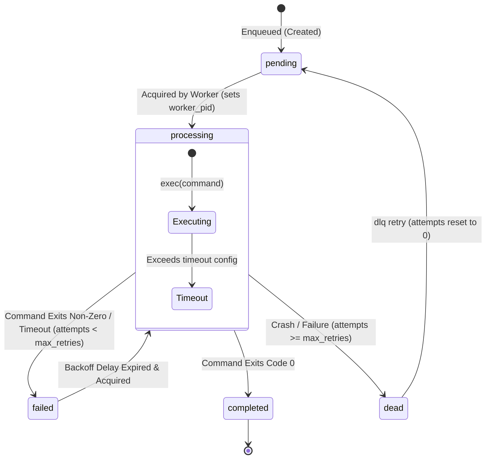
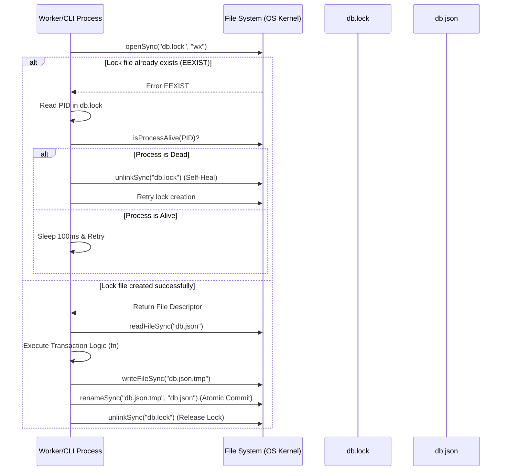
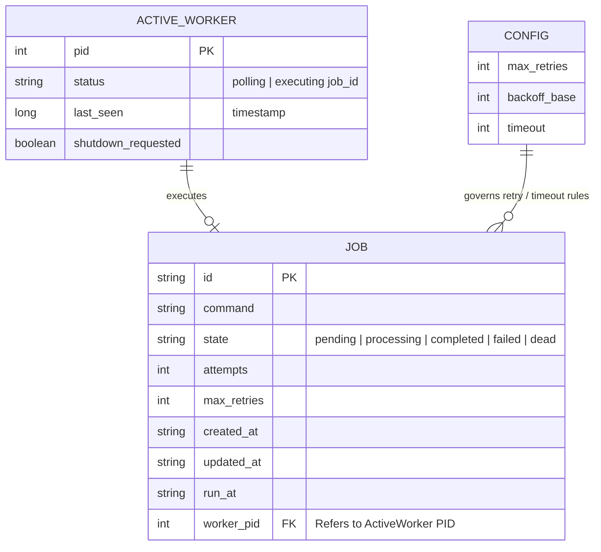
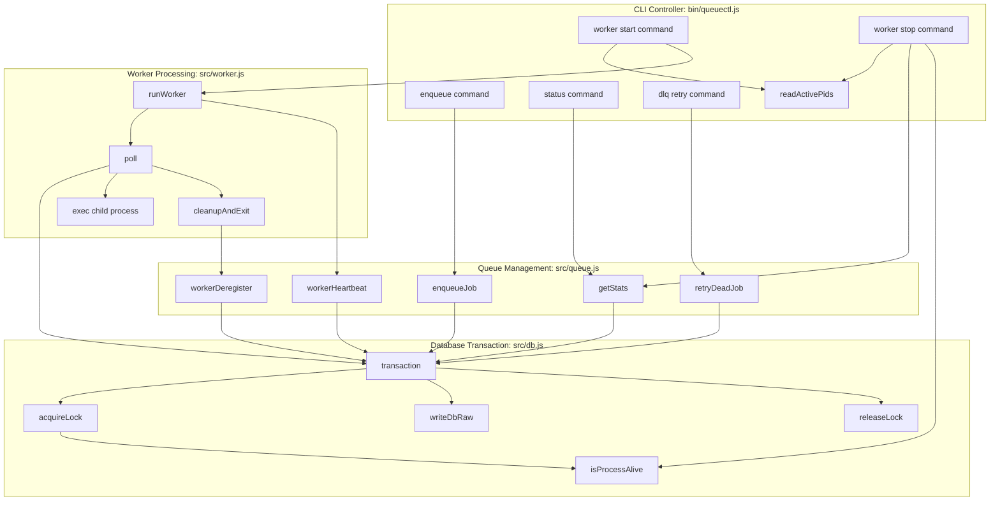

# QueueCTL - Architecture and Design Specification

This document details the system design, core lifecycles, execution flows, and technology stack of QueueCTL, broken down function-by-function.

---

## 1. Technology Stack
* **Runtime**: Node.js (v18+).
* **CLI Engine**: `commander` (for command parsing and option routing) and `inquirer` (for interactive Prompts).
* **Concurrency & Storage**: Flat-file JSON (`db.json`) using standard Node `fs` (file system) APIs, controlled via exclusive filesystem lockfiles (`db.lock`) using kernel-level atomic `O_CREAT | O_EXCL` flags.
* **Process Management**: Native Node `child_process` module:
  * `fork` to spawn background workers.
  * `exec` to invoke individual job commands.
  * `spawn` to bridge the dashboard API server and the React Vite development server.
* **OS-Level Signaling**: Standard POSIX signaling (`SIGINT`, `SIGTERM`) combined with Windows console-specific signals (`SIGBREAK`) and shell-based process tree killers (`taskkill /T /F`).

---

## 2. Core Lifecycles and Flows

### A. Job State Lifecycles


---

### B. Concurrency-Safe Database Transaction Flow


---

### C. Worker Heartbeat and Crash Recovery Flow
```mermaid
flowchart TD
    A[Worker Starts] --> B[Start 1s Background Interval]
    B --> C[Send Heartbeat: last_seen = Date.now()]
    C --> D[Is Job Executing?]
    D -- Yes --> E[Status: 'executing job_id']
    D -- No --> F[Status: 'polling']
    E --> G[Sleep 1s]
    F --> G
    G --> C

    H[Any Active Worker Polls] --> I[Scan Jobs in 'processing' State]
    I --> J{Is worker_pid alive?}
    J -- Yes: now - last_seen < 10s --> K[Do Nothing]
    J -- No: missing or silent > 10s --> L[Reclaim Job]
    L --> M[Increment attempts + Clear worker_pid]
    M --> N{attempts >= max_retries?}
    N -- Yes --> O[Set state: 'dead']
    N -- No --> P[Set state: 'failed' + Set run_at with backoff]
    O --> Q[Delete Stale Worker from activeWorkers]
    P --> Q
```

---

### D. Database Schema & Relationships (Entity-Relationship Diagram)


---

### E. Function Call Flow Diagram



